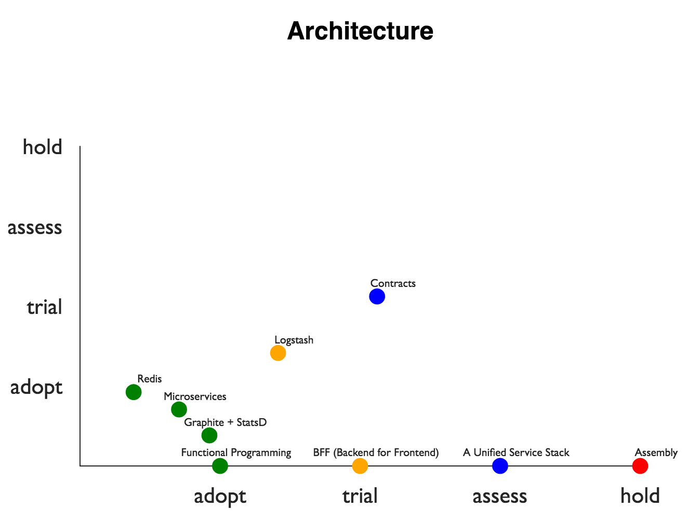

# Lidar

A take on ThoughtWorks' Radar. You can use this tool and system to make your
very own technological Radar.

<h3 align="center">
  
</h3>

## Quick Start

The ToughtWorks tech radar model divides subjects to four simple stages:

1. Adopt
2. Trial
3. Assess
4. Hold

Progression is made from step (3) to (1), and some times, subjects find themselves
at (4) because we've decided to stop investing in them.

Given that you have created a tech radar repository in the [specificed format](#format),
you can now run `lidar` on it and it will generate a radar visualization:

```
$ npm i -g lidar
$ lidar radar/architecture 2016/09
```

The timestamp following the topic (here, `architecture`), is designating a
specific _issue_ of this radar (think about magazine issues). Once in a while
you'll publish a new radar issue to your readers.

## Format

The material on the Radar, is formatted in a very convenient markdown format,
and a simple directory layout:

```
radar/
  architecture/
    assess.md
    trial.md
    adopt.md
    hold.md
  tools/
    (same structure here)
  techniques/
    (same structure here)
```

On each stage, effectively a markdown document, we're write about the subjects.
Treat it as writing a book, or a nice story. For each subject the following
format should be used:

```
## Hoverboards
_2016/09_

We believe using hoverboards in the office will make commuting between
tables much more efficient.

This paragraph will not appear in a generated Radar.

### Nor will this headline.
```


In order for this to be both machine and human friendly, there are simple
formatting rules, that will help us generate a Radar graph should we want to:

* Level-2 heading `##` will be the title, and the paragraph immediately
below it will be the description.

* An issue, that correspond to a publication or entry date (typically month),
  right below the header, italics, for example: `_2016/09_`, corresponds to
  2016, September.

* Items should be sorted / added alphabetically (on a Level-2 heading).

* The rest, is free form.


# Hacking

To work on this project you want to clone this repo and:

```
$ npm i
$ npm start
```

Once you're happy there's no need to `npm build`. The build step will
happen on release.


# Contributing

Fork, implement, add tests, pull request, get my everlasting thanks and a respectable place here :).


### Thanks:

To all [Contributors](https://github.com/jondot/lidar/graphs/contributors) - you make this happen, thanks!


# Copyright

Copyright (c) 2016 [Dotan Nahum](http://gplus.to/dotan) [@jondot](http://twitter.com/jondot). See [LICENSE](LICENSE.txt) for further details.

